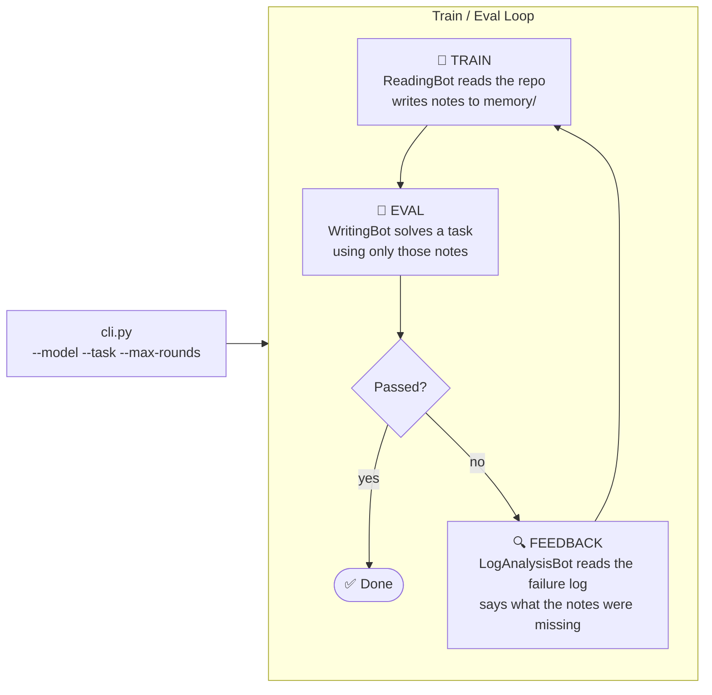
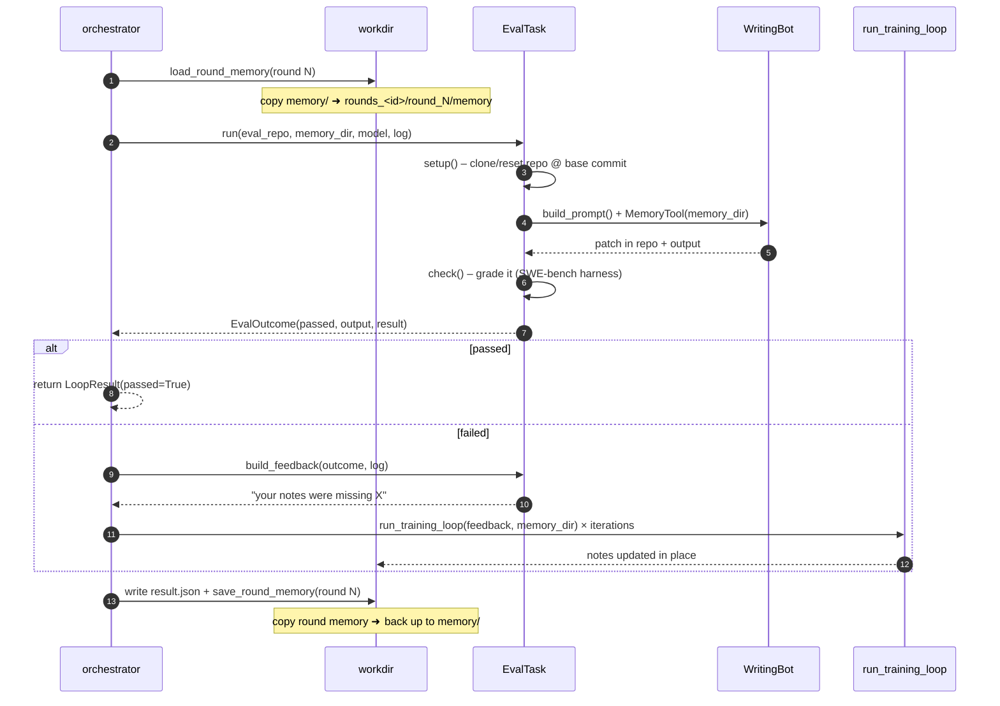
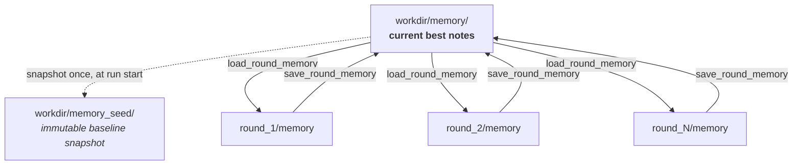
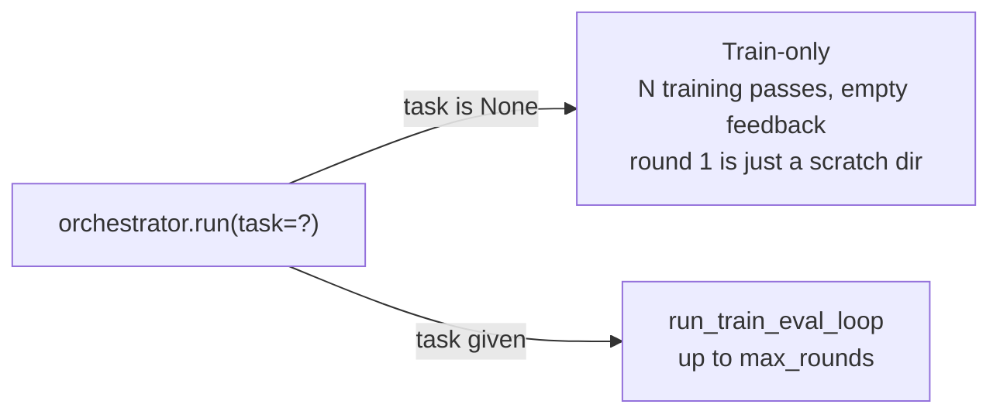

# auto_memory — Architecture

An agent that **learns a repository into memory notes**, then **proves those notes work** by
solving a real task with them. If it fails, it learns again from the failure and retries.

> Train → Eval → Feedback → Train → … until pass (or rounds run out).

---

## 1. The Big Picture



**Key idea:** the eval agent gets *no* extra hints — only the memory notes.
So a failing eval is direct evidence the notes are wrong or incomplete.

---

## 2. The Cast

| File | Role | One-liner |
|---|---|---|
| `cli.py` | Entry point | Parses args, builds tasks, calls the orchestrator |
| `orchestrator.py` | Conductor | Owns the round loop, clones repo, wires train ↔ eval |
| `evalTask.py` | Contract | Abstract `EvalTask`: `run`, `check`, `build_feedback`, … |
| `task_registry.py` | Plugin table | `@register_task("name")` + auto-import of `eval/*` |
| `eval/swebenchverified.py` | A real task | One SWE-bench-Verified issue, graded by the official harness |
| `training/runner.py` | Trainer | One `ReadingBot` pass + `MemoryTool` |
| `training/training_instructions.md` | Trainer's brief | "Learn the repo, write notes, never edit code" |
| `workdir.py` | Filing clerk | Every path under `workdir/` lives here — nothing is hard-coded elsewhere |

---

## 3. One Round, Step by Step



---

## 4. Memory Lifecycle (the heart of it)

Memory is a **directory of markdown notes** that is copied down into each round,
mutated by the bots, then copied back up.



Rules that matter:

- **Replace, never merge.** `load`/`save` do `rmtree` + `copytree`, so deleted notes stay deleted
  and stale files from a crashed round can't leak in.
- **`memory_seed` is written once.** It preserves the pre-run state, because `memory/` is
  mutated in place all run long.
- **Memory carries across tasks.** Multiple task instances in one workdir share `memory/`,
  so later instances inherit what earlier ones learned.

---

## 5. Workdir Layout

```text
workdir/
├── config.yaml            # repo URL + task_args
├── repo/                  # persistent clone — TRAINING only
├── eval_repo/             # task-managed clone — EVAL only (reset each round)
├── memory_seed/           # baseline snapshot (write-once)
├── memory/                # current best notes  ← the thing being optimized
└── rounds_<task_id>/      # per-task-instance, so instances never collide
    └── round_N/
        ├── memory/        # this round's working copy of the notes
        └── eval/
            ├── eval.log   # agent output + harness logs (feeds LogAnalysisBot)
            └── result.json
```

Two repos on purpose: the eval task wipes/resets its checkout every round, which
would otherwise destroy the training checkout.

---

## 6. Two Modes



```bash
# train only
python -m microbots.auto_memory.cli --model azure-openai/gpt-5.5

# train + eval against a SWE-bench instance
python -m microbots.auto_memory.cli \
    --model azure-openai/gpt-5.5 \
    --task swebenchverified \
    --max-rounds 5 --training-iterations 10
```

---

## 7. Adding a New Eval Task

Drop a module in `eval/` — `discover_tasks()` imports everything in that package,
so the `@register_task` decorator fires and the name shows up in `--task`. No central
factory to edit.

```python
@register_task("mytask")
class MyTask(EvalTask):
    @classmethod
    def from_config(cls, task_args: dict) -> list["EvalTask"]:
        ...   # one instance per unit of work

    def run(self, repo_path, memory_dir, model, log_path) -> EvalOutcome:
        ...   # you drive setup/build_prompt/check yourself

    def build_feedback(self, outcome, repo_path, model, log_path) -> str:
        ...   # turn the failure log into "what the notes should say"
```

Required: `from_config`, `run`, `build_feedback`.
Optional hooks (`setup`, `build_prompt`, `check`, `teardown`, `build_result`, `task_id`)
are **not** called automatically — your `run` decides.

---

## 8. Failure Handling at a Glance

| Where it breaks | What happens |
|---|---|
| Agent run raises | Caught in `run`; logged; round fails with the exception as the reason |
| `build_feedback` / retraining raises | Logged; loop **continues to the next round** without retraining |
| Repo dir exists with wrong `origin` | Removed and re-cloned (never silently trains on wrong code) |
| `max_rounds` exhausted | `LoopResult(passed=False)` with every round's outcome |

Whatever happens, the `finally` block still writes `result.json` and saves the round's memory.
